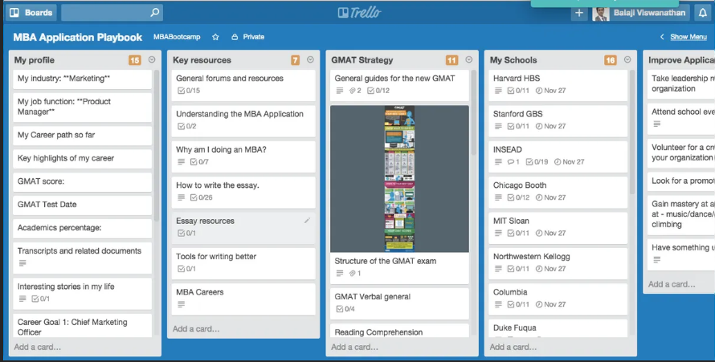

# Frontend Assessment
 
 > Case info file link : [case](CASE.md)

 # My Goal For Similar UI




## Installation

To install assessment-frontend, follow these steps:
Clone the repository:

```
git clone `repository_url`
```

Navigate to the project directory:

```
cd assessment-frontend
```

Install dependencies:

```
npm install
```

Run the app:

```
npm run dev
```

### License

Licensend with [MIT](LICENSE).