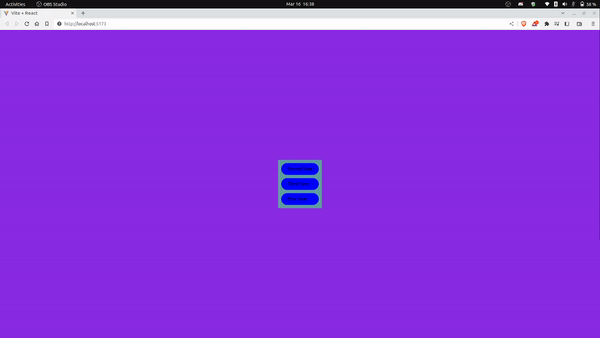

# Draft First


<p style="margin-bottom:40px;">( Draft screen view gif )</p>

## Installation

To install , follow these steps:
Clone the repository:

```
git clone `repository_url`
```

Navigate to the project directory:

```
cd draft-first
```

Install dependencies:

```
npm install
```

Run the app:

```
npm run dev
```
